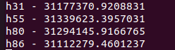
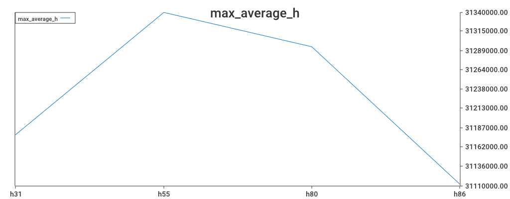

# Map.Reduce

## Content
1. [Description](#description)
2. [Solution](#solution)

## Description
        Сотовый оператор обновляет оборудование на сотовой станции. В оборудовании есть
    странная настройка параметр h, поставщик оборудование за правильное значение требует
    непозволительно высокую оплату.
### Задача от оператора:
        По данным 20 пользовательских логов понять и обосновано показать какая из значений h
    предпочтительна. Цель повысить лояльность клиентов пользователей, в самом простом варианте
    увеличить пиковую скорость для всех пользователей в один момент времени.
        Описание данных:
        В файлах вида userlog.hXX.uYY.csv представлены данные телеметрии с приложения у
    пользователя за неделю. Первый столбец “Day” - день недели, “TickTime” - второй столбец время
        в секундах, когда было зафиксирSоpвeаeнdп”оказатель моментальной скорости интернета упользователя – третий столбец “
    в байтах.
        В имYеYнах файлов параметру XX – соответствует текущее значение параметра h на станции,параметру
     – текущий номер пользователя. Одинаковый номер пользователя во всех файлах
    соответствует одному и тому же человеку. Измерения с разным значение h проводилось в
    течении недели, после чего значение h менялось.
### Минимальные технологические требование к решению
        Реализованная самостоятельно (без Apache Hadoop и Microsoft Azure) схема MapReduce
    (этапы Map -- MergeSort – Reduce) на любом языке программирования. Реализация должна не
    загружать все данные сразу в доступную ОЗУ. Сетевое взаимодействие между вычислительными
    узлами можно не реализовывать и остаться на уровне многопоточности в рамках одной
    программы. Реализация успешно использована для расчета средней скорости подключения
    пользователей при каждом значении h. Реализация использована для расчёта любых
    дополнительных метрик, которые сочтете полезными для обоснования выборка в пользу того
    или иного h.
### Дополнительные примечания
        Указанная скорость не максимальная, а текущая предоставленная под потребности пользователя.
        Пользователи как правило не теряют неожиданно скорость, а снижают её плавно. Резкое
    снижение может сигнализировать о перегрузки базовой станции сотового оператора, особенно
    если соответствует суммарной высокой скорости сервиса за тот же период период.

## Solution

